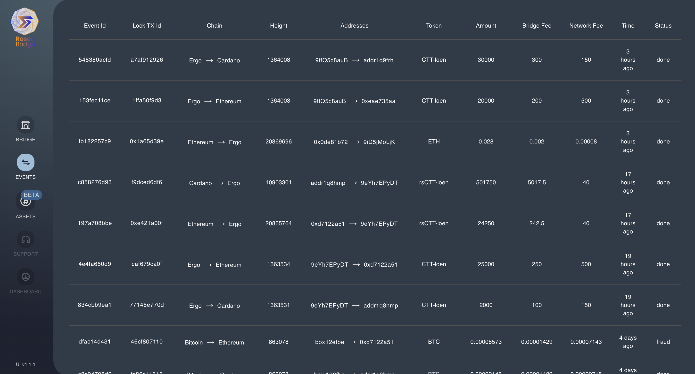
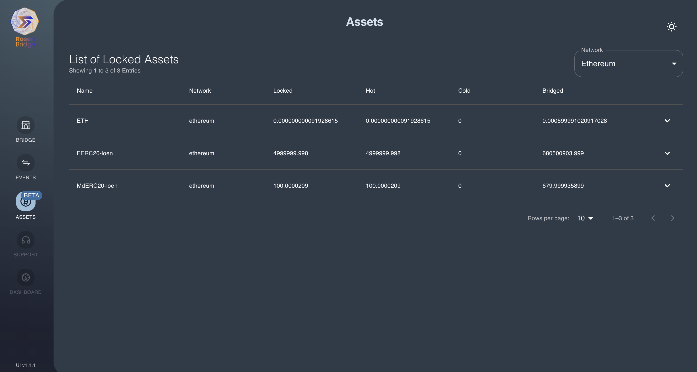
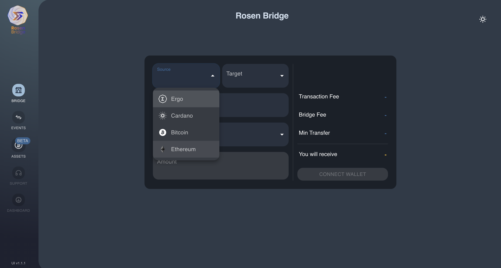
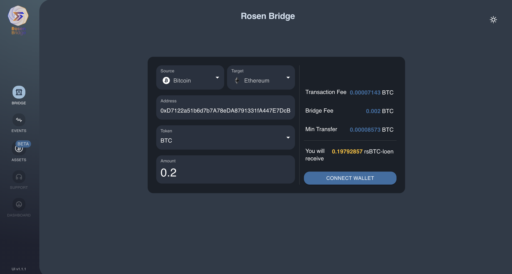

# Ethereum Integration in Rosen Bridge

This document states the integration of Ethereum modules in Rosen Bridge.

## Contents
- [Ethereum Integration](#ethereum-integration)
  - [Watcher Service](#watcher-service)
  - [Guard Service](#guard-service)
  - [UI](#ui)
- [Testing](#testing)

## Ethereum Integration
As the required modules are implemented in previous milestone, they are integrated in Rosen services and tested. The services are Watcher, Guard and UI which includes Rosen App and Rosen Service.

### Watcher Service
The integration includes:
- Enabling Ethereum chain and add default configs
- Adding Ethereum Scanner and Extractors
- Adding Scanner Sync health-check for Ethereum

The service is tested after integration and successfully watched the Ethereum events.

Related Commits:
- [Main Integration](https://github.com/rosen-bridge/watcher/commit/99c280c177b9f95fb4d5225e6b2f42eacc47f42c)
- [Add Health-check](https://github.com/rosen-bridge/watcher/commit/b805ecc66187c61422a0321590b00afd07bd34d1)

### Guard Service
The integration includes:
- Adding Ethereum chain and its configs
- Adding Ethereum rosen-chains modules to Guard `ChainHandler` module
- Adding Ethereum Extractors
- Adding Asset health-check for Ethereum

> Since `EvmRpcNetwork` requires scanner, Ethereum scanner and Scanner Sync health-check are also required.

Some bugs were found and fixed during the tests. Also some other refactor and improvements were required before integrating Ethereum chain, such as [limiting number of try for events based on their unexpected failure](https://github.com/rosen-bridge/guard-service/commit/dfe42a63e2f4828e9b216b3d20fc7b9233fb0c9c) which are omitted in this document.

Related Commits:
- [Main Integration](https://github.com/rosen-bridge/guard-service/commit/121d77c7a73f3f0a4183783dcb82096f14f2fc5f)
- [Fix Bug (fix serlization between rosen-chains and rosen-extractor)](https://github.com/rosen-bridge/guard-service/commit/78a717cdbb5c88399fa2dca7a2783c45eae0496a)
- [Fix Bugs](https://github.com/rosen-bridge/guard-service/commit/74984cf3228c0429c1f1949ca701749459ec4af5)
  - setup `EvmTxExtractor` to track address txs for `EvmRpcNetwork`
  - fix reading bigint values from node config
- Refactor (changing payment tx id format in reward tx to faciliate Ethereum events)
  - [Update in Guard](https://github.com/rosen-bridge/guard-service/commit/9986e27087905e97a825269a431876dadf7a81a7)
  - [Update in Extractor](https://github.com/rosen-bridge/guard-service/commit/0a86b774aac2ce533db33efef37b601e9e96b248)
- [Refactor Cold Storage (supporting parallel cold storage txs)](https://github.com/rosen-bridge/guard-service/commit/f8ab88b369328dcdd9a53d3c12ae5bae70fbbbb5)
- [Fix Bug and Improvement (catch errors and improve default config values)](https://github.com/rosen-bridge/guard-service/commit/7d148d3b52ba5fafd4b4a8396b639885740eda6c)
- [Add Health-check, Notification and Improvements](https://github.com/rosen-bridge/guard-service/commit/31d30b1ac0184e030322df6a93d53eea0b1cbfc3)

### UI
The integration includes:
- implementing required modules to generate lock transaction on Ethereum chain
- adding at least one wallet (Metamask in this case) for Ethereum chain
- adding Ethereum to `asset-calculator` module (i.e. the module that extracts the amount of locked and bridged for supported tokens on Ethereum)
- minor integrations such as adding links for Ethereum transactions, icons, etc.

Each integration was splitted into multiple smaller cases and merge requests. At the same time, some refactors were done to faciliate Ethereum integration, improve maintenance and fix some bugs. The final code is available at [Rosen UI Repository](https://github.com/rosen-bridge/ui).

## Testing
All scenarios related to changed modules and Ethereum are tested to ensure the successful integration of Ethereum. Example of Rosen events page containing test events: 

Example of Rosen assets page containing Ethereum assets: 

Some notable test events in details:

1. Transfer ETH from Ethereum to Cardano
    - event ID: `1d10dcf138d8ff12b2bf2b6343da6ef5cc5c3a4c5eeb86cd96e7b7b291bfee00`
    - lock tx: https://etherscan.io/tx/0x75b459592ad0b2397d99cbd7fb7d2815f252f642737c8059780172c767817ed9
    - trigger tx: https://explorer.ergoplatform.com/en/transactions/643be9fe156c43b218db8f3f3294e379681272084dfd7cfaf73460021fd91ca7
    - payment tx: https://cardanoscan.io/transaction/transactions/88010f750f331b323b95ac83e456dc47554c7d7463b4a1ec2deb0ac98a09f977
    - reward tx: https://explorer.ergoplatform.com/en/transactions/f39d4de796673d2b7428543b614277df35125d70eec965412d4cab90e50cd313
    - details
      - lock amount: `2,100,001` (0.0021 ETH)
      - bridge fee: `2,000,000`
      - network fee: `100,000`
      - RSN emission: `100,000`
      - received amount: `1`

2. Transfer Ada from Ethereum to Cardano
    - event ID: `898c65ee0b819f469c1c7dfe169ecd6e72705081f8a2342b065b67948c6035c9`
    - lock tx: https://etherscan.io/tx/0xb25ce48682a06c381ed09bab608ccf11609aeeede70d357543d3b79e09f4b0d1
    - trigger tx: https://explorer.ergoplatform.com/en/transactions/b65916063e3815dd6c3c779b053c95503c89a13e62e7dd27b80e3d32e2823c7f
    - payment tx: https://cardanoscan.io/transaction/2ee51a79959bd8602fde4c9fb5946edf7ec6a500b397ceecdd9925e3fb1b9f11
    - reward tx: https://explorer.ergoplatform.com/en/transactions/d454e2c2f63bfff3578107d2db17bec05bd24bc2a0e06a0375587d50eaec8d7d
    - details
      - lock amount: `5,000,001` (5 ADA)
      - bridge fee: `4,000,000`
      - network fee: `1,000,000`
      - RSN emission: `100,000`
      - received amount: `1`

3. Transfer MdERC20-loen (an Ethereum residency token with different decimals accross chains) from Ethereum to Cardano
    - event ID: `cb0dfacfbbb664c2a797fb2987e2a2fbfd5a6ab0ec513ff07b0a8d56751e26c5`
    - lock tx: https://etherscan.io/tx/0xdfcd3737f9022d978c1ab41ec1f10ccb8c6da376957c22862ed2ea92e4beb053
    - trigger tx: https://explorer.ergoplatform.com/en/transactions/e71220692e798bb0de6c5017732c91cf4c1ea55bbbfa8563e0db8ba4df8337c0
    - payment and reward tx: https://explorer.ergoplatform.com/en/transactions/f5496a406353e32fb5963038c565daa5cf02d5497beb6218624474fd0925c2f8
    - details
      - lock amount: `10,401`
      - bridge fee: `10,000,000`
      - network fee: `400,000`
      - RSN emission: `100,000`
      - received amount: `1,00`

Rosen App bridge page with Ethereum:

